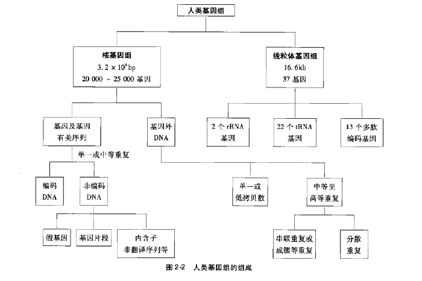
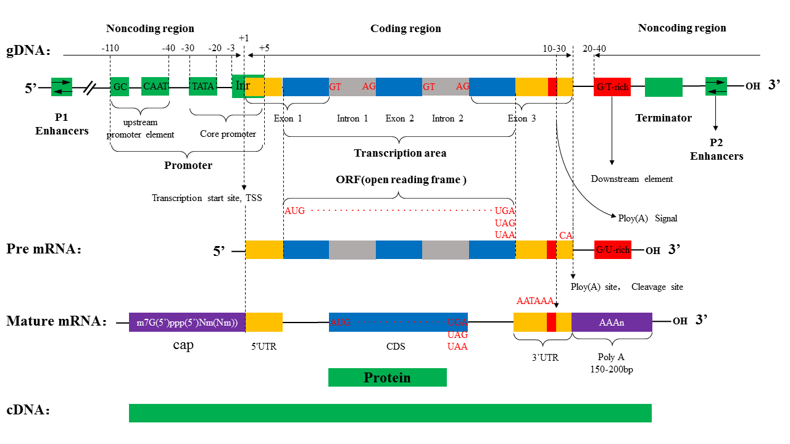
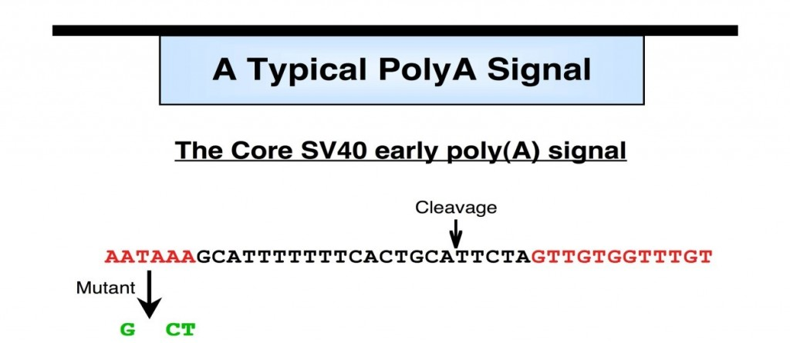
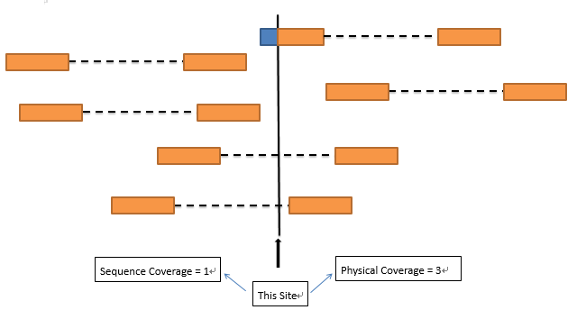

# 1. 人类基因组

+ **genome：**一个物种的全部遗传物质，真核生物包括核基因和质基因；

## 1.1 参考序列

+ XY染色体上相同序列 **PAR1** **PAR2**  

  chrY:10001-2649520 and chrY:59034050-59363566  
  chrX:60001-2699520 and chrX:154931044-155260560  

+ 参考基因组中的多余序列  

  The chr\*\_random sequences are unplaced sequence on those reference
  chromosomes.  
  The chrUn\_\* sequences are unlocalized sequences where the corresponding reference chromosome has not been determined.

# 2 基因

**基因(gene)**：表达基因产物的全部DNA序列,包括启动子,5'UTR, ORF序列，外显子，内含子，3'UTR，以及调控区

* 启动子
  + CAAT框（CAAT box）：其一致顺序为GGCTCAATCT，是真核生物基因常有的调节区，位于转录起始点上游约-80bp处，可能也是RNA聚合酶的一个结合处，控制着转录起始的频率。  
  CAAT盒是最早被人们描述的常见启动子元件之一，常位于接近-80的位置，但是它可以在离起始点较远的距离仍能起作用，且在两种取向均可发挥作用。CAAT盒的突变敏感性提示了它在决定转录效率上有很强的作用，但是突变对启动子的特异性没有影响。

* 开放阅读框(open reading frame，ORF)：在mRNA上从起始密码子到终止密码子之间的一段序列，该段序列可能编码蛋白质，也可能不编码；
* 
编码区(coding sequences，CDS) : CDS是检查cDNA后得到的编码组合序列，能翻译成氨基酸序列的DNA序列，从起始密码子到终止密码子，也就是说CDS与所翻译的氨基酸序列存在严格的3对1的关系；
  + 

  + 每个外显子与内含子的接头部位，都有一高度保守的共有序列，为剪接识别信号，即每个内含子5‘端的两个核苷酸都是**GT**，3‘端的两个核苷酸都是**AG**，这种连接方式称为**GT-AG**法则，是真核细胞中基因表达时剪切内含子和拼接外显子的共同机制。

mRNA:基因转录后加工成熟用于翻译蛋白质的序列，包括ORF（此时ORF与CDS相同）序列，3'UTR，5'UTR，5'帽子及3'Poly (A)尾；

hnRNA:核不均一RNA，是指转录获得的最原始序列，没有经过任何加工，序列包含从转录起始位点到转录终止位点的全部序列；

cDNA：通过mRNA反转录所得，与mRNA序列互补的单链DNA或者与mRNA对应的DNA双链；

EST：表达序列标签，是指从一个随机选择的cDNA 克隆，进行5’端和3’端单一次测序挑选出来获得的短的cDNA
部分序列,代表一个完整基因的一小部分，在数据库中其长度一般从20 到7000bp 不等，平均长度为360
±120bp。由于cDNA文库的复杂性和测序的随机性，有时多个EST代表同一基因或基因组，将其归类形成EST簇（EST cluster)；

几者关系：

1、DNA就是表示一段脱氧核糖核酸序列；

2、包含关系：gene ∈ genome；EST ∈ cDNA；CDS ∈ ORF；mRNA ∈ hnRNA

说明：基因组上包含若干基因，不多说；一段mRNA上可能包含很多个ORF（只要是以起始密码子开始，终止密码子结束），但是只有能翻译成蛋白质的ORF才能称之为CDS；EST序列是在随机测序过程中获得的cDNA序列的一部分；hnRNA需要经过加工，生成成熟的功能RNA，一条hnRNA可能加工成多条mRNA，也有可能不加工成mRNA而是其他功能RNA，如rRNA，tRNA，核酶等；

3、映射关系：mRNA &amp; cDNA

mRNA与cDNA单链互补，且A与U互补

1.DNA复制：以DNA为模板，在DNA聚合酶的催化作用下，将四种游离的dNTP按照碱基互补配对原则合成新链DNA

转录：以DNA为模版，在DNA指导的RNA聚合酶的作用下，将四种游离的NTP按照碱基互补配对的原则合成RNA

翻译：以mRNA为模板，在核糖体内合成蛋白质的过程

特点|模板|特点|原料| |引物
---|---|---|---|---|---  
DNA复制|双链DNA|合成的新链与模板链一模一样|四种dNTP|半保留复制|需要  
转录|双链DNA|合成的新链除了把DNA上的T改为U外，其他一样|四种NTP|半不连续转录|不需要  
翻译|mRNA|3个碱基决定一个氨基酸|20种游离的氨基酸|  |

2.mRNA（messenger RNA， 信使RNA）

信使RNA是由DNA经hnRNA剪接而成，携带遗传信息的能指导蛋白合成的一类单链核糖核酸。

3. 

4.CDS  Sequence coding for amino acids in protein 蛋白质编码区

 CDS是Coding sequence的缩写，是编码一段蛋白产物的序列，是结构基因组学术语。

与开放读码框ORF的区别

开放读码框是从一个起始密码子开始到一个终止密码子结束的一段序列；不是所有读码框都能被表达出蛋白产物，或者能表达出占有优势或者能产生生物学功能的蛋白。
CDS，是编码一段蛋白产物的序列。 cds必定是一个orf。但也可能包括很多orf。 反之，每个orf不一定都是cds。 Open reading
frame (ORF) - a reading frame that does not contain a nucleotide triplet which
stops translation before formation of a complete polypeptide.  Coding sequence
(CDS) - The portion of DNA that codes for transcription of messenger RNA  ORF
-----translation, CDS----transcription  translation
是理论上的，而transcription则显然是事实存在的。

5.外显子拼接形成成熟的mRNA，多数基因都有UTR,它们也是外显子拼接的产物，所以，你会发现mRNA的长度要大于CDS，只有CDS才编码蛋白，AUG以前的mRNA编码前导序列。

外显子并不一定编码蛋白质，成熟mRNA的UTR也可以是外显子，外显子就是RNA剪接后留下的部分  
外显子与CDS区不是完全一致的，cds区一定属于外显子，但是外显子不一定是CDS区，也就是说外显子不一定都能翻译成蛋白的。

mRNA包括UTR和CDS！

内含子（intron）是断裂基因中外显子之间的间隔序列（intervening
sequence，IVS），可参与前体RNA的转录，但其转录的RNA序列于转录后的加工中被切除，不包括于成熟的RNA分子中。外显子（exon）在断裂基因中，转录成熟RNA中相应序列的DNA片段。

内含子和外显子的分界线在于：GU-AG法则。即每个内含子的开始两个碱基都是是GU（或GT），最后两个是AG。

2\. 3`UTR的结构

3`UTR是PolyA尾巴的载体，而加这个尾巴关键的是PloyA
signal。这个信号位点在3`UTR富含T或GT和其上游AATAAA信号中间，大约离AATAAA20-25个核苷酸，这个位点叫Cleavage
site。如果AATAAA发生突变，那么PolyA signal就不会被激活。

3\. 测序与物理覆盖度

一度想不明白测序覆盖度与物理覆盖度的区别，查了半天的SA才明白了一些，只存在PE测序文库中，画了一张简化图给大家看。

