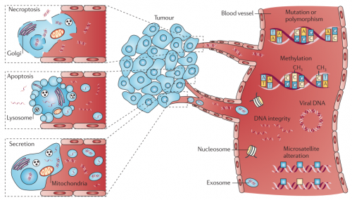
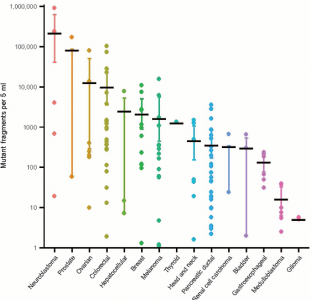
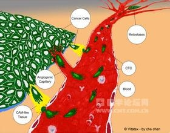

#  肿瘤的近亲--cfDNA,ctDNA,CTC

全称循环游离DNA（Circulating free DNA），是指存在于循环血中的DNA片段。cfDNA可以来源于凋亡、坏死的细胞释放释放的DNA片段；细胞以囊泡的形式分泌到循环血中的DNA片段；外源微生物的DNA片段（如病毒DNA）等。它既可以是来自于体内正常的细胞，也可能是来自肿瘤细胞，或者外源微生物。早在1948年来自法国的两位学者Mandeland
Métais提出cell-free nucleic acid(cfNA)这一概念，但直到1994年科学家在肿瘤患者的血液中发现了携带有RAS基因突变的DNA片段这一概念才引起了科学家的重视。

   与传统的穿刺活检相比，循环游离DNA的检测又被称为液体活检（liquid
biopsy）。通过采集患者的外周血，检测血液中是否含有待检DNA序列及含量的多少来诊断患者是否患病、治疗是否有效，治疗后的复发监测等，是一种新兴的无创诊断、监测手段，所以又被形象地称为“液体活检”。有研究表明正常人cfDNA的含量约30ng/ml(0-100ng/ml),肿瘤患者循环血中的cfDNA含量平均约180ng/ml(0~&gt;1000ng/ml)。虽然肿瘤患者的循环血中含有更多的cfDNA，但是单单用cfDNA的含量多少来诊断疾病或者预测患者预后可能不太可靠，来自European
Prospective Investigation into Cancer andNutrition
(EPIC)的大人群回顾性的研究表明cfDNA的浓度可能与人群的来源和接受治疗的不同而不同。

目前cfDNA更多的用于肿瘤的早期诊断和、疗效、复发监测等领域。近年来有大量的研究表明cfDNA的检测能够作为有效的生物标记物（biomarker）而被科学工作者所热捧，随着检测技术的发展很有可能进入临床应用。  

ctDNA (Circulating tumorDNA )
循环肿瘤DNA。是指来自肿瘤细胞的循环游离DNA。是cfDNA的一个小的亚类。研究表明一个100g的实体肿瘤大概含有3*10^10个肿瘤细胞，每天大约有3.3%的肿瘤细胞DNA进入循环血。这些循环肿瘤DNA的长度基本上在70-200bp,有的能够长达21kb。这些来自肿瘤的cfDNA,常常携带有肿瘤细胞的一些特质，如特定的突变，结构改变，表观遗传信息等从而成为肿瘤的诊断、复发监测、疗效评估的有效手段。Detection
of Circulating Tumor DNA in Early-and Late-Stage Human Malignancies

  

CTC (circulatingtumor cell)循环肿瘤细胞。循环肿瘤细胞（CTCs）被认为是一种来源于肿瘤原发灶或是转移灶的，在特定条件下释放入外周血液循环的一些肿瘤细胞。这些细胞的含量非常稀少具有肿瘤细胞的特殊表型，在肿瘤发生转移之前的过程既可出现。因此CTCs也被认为是一种转移的前体细胞，是肿瘤获得侵袭性能力的体现。而如今对CTCs的无创性检测和监视，可以为肿瘤的早期诊断、疗效评估及靶向药物的设计提供一条非常有效的途径。

  

