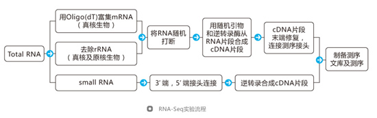
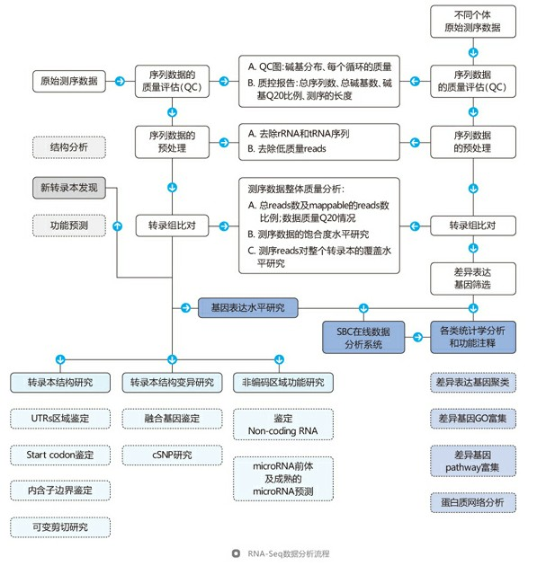

# 转录组测序概述及实验分析流程

## 一、转录组测序概述

转录组是特定物种、组织或细胞类型转录的所有RNA（转录本）的集合，包括mRNA和非编码RNA(Non-coding RNA， 非编码RNA又包括：tRNA，rRNA，snoRNA，microRNA，piRNA，lncRNA等。通过比较转录组或基因表达谱的研究以揭示生物学现象或疾病发生的分子机制是高通量组学研究的一个常用策略。利用高通量测序技术研究转录组在全面快速得到基因表达谱变化的同时，还可以通过测定的序列信息精确地分析转录本的cSNP（编码序列单核苷酸多态性）、可变剪接等序列及结构变异，另外对于检测低丰度转录本和发现新转录本具有其独特的优势。  

## 二、研究转录组方法有哪些

目前研究转录组的方法主要三种：
1. 基于杂交技术的cDNA芯片和寡聚核苷酸芯片
2. 基于sanger测序法的SAGE (serial analysis of gene expression)、LongSAGE和MPSS(massively parallelsignature sequencing)
3. 基于第二代测序技术的转录组测序，又称为RNA-Seq。

## 三、转录组测序有什么样的样品要求？

样品纯度要求： OD值应在1.8至2.2之间；电泳检测28S:18S至少大于1.8。  
样品浓度： totalRNA浓度不低于400ng/μg。  
total RNA样品请置于-20℃保存；请提供totalRNA样品具体浓度、体积、制备时间、溶剂名称及物种来源。请同时附上QC数据，包括电泳胶图、分光光度或Nanodrop仪器检测数据。  
样品请置于1.5ml管中，管上注明样品名称、浓度以及制备时间，管口使用Parafilm封口。建议使用干冰运输，并且尽量选用较快的邮递方式，以降低运输过程中样品降解的可能性。

## 四、转录组测序需要多大的测序量才能得到有意义的结果？

**转录组测序前，需要对物种转录组的大小进行评估，评估方法如下：**  
1. 对于有reference genome的物种，可以分析基因组信息，统计编码基因的个数，及其碱基数，从而估计物种转录组的大小，另外可以查询相关或相近物种转录组研究的文献，作为参考。  
2. 对于无reference genome的物种则只能参考相近物种的转录组大小。  
由于转录组需要进行表达量的分析，因此在转录组测序中不推荐覆盖度，在进行不同基因和不同实验间的基因表达差异分析时，人们提出了RPKM和FPKM的概念。RPKM（Reads
Per Kilo bases per Million reads）是每百万reads中来自于某基因每千碱基长度的reads数。FPKM(fragments
per kilobase of exon per million fragments mapped).
FPKM与RPKM计算方法基本一致。不同点就是FPKM计算的是fragments，而RPKM计算的是reads。Fragment比read的含义更广，因此FPKM包含的意义也更广，可以是pair-
end的一个fragment，也可以是一个read。因此，在确定转录组的测序量时，最好以产生的读长数目做依据，参照转录组大小，估计需要的读长数目，来确定转录组需要的测序量。  
  
## 五、转录组测序实验技术路线

## 六、转录组测序数据分析技术路线

